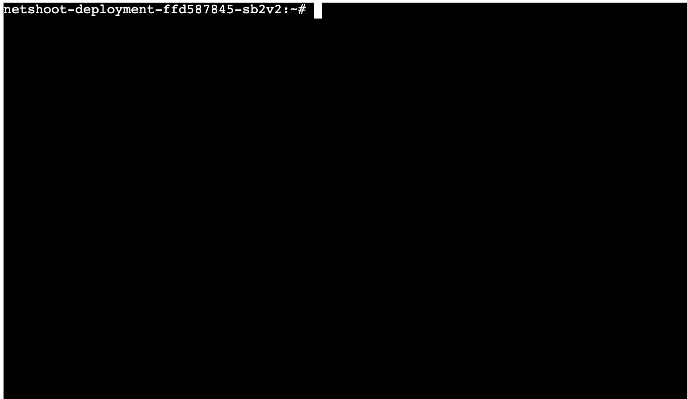

# fork  后修改部分
修改 go mod 匹配 k8s 1.22.x 版本使用
## 示例
go run main.go 启动后

可访问链接形如，修改参数即可

http://127.0.0.1:8888/k8s-ws/terminal?namespace=default&pod=netshoot-deployment-ffd587845-sb2v2&container=netshoot

# k8s-webshell-gin

Golang实现登入k8s中指定pod内容器的Webshell功能，基于GIN框架、k8s/client-go，预留组内鉴权中间件。

Golang implements the webshell function of logging in k8s to specify pod content device. Based on gin framework and k8s/client-go, the authentication Middleware in the group is reserved

## 快速开始
1. 将项目根目录下的YOUR_K8S.conf替换为你自己的KUBECONFIG，如果是yaml文件直接将内容复制进.conf内即可
2. 修改init_client.go中的ioutil.ReadFile("./YOUR_K8S.conf")中的文件名称
3. 确保你的KUBECONFIG正确,能在终端中通过kubectl get pod 获取pod

## 流程
- web端GET请求，server端响应前端资源
- webshell发起websocket请求，server端升级连接
- K8s/client-go 建立与container的ssh长连接，通过 websocket 连接实现PtyHandle接口的读写方法。
- 使用组内中间件进行鉴权

具体流程如下图所示:

## Quick Start
1. Replace YOUR_K8S.conf with your own kubeconfig. If it is a yaml file, copy the contents into .conf file directly
2. Modify init_client.go with correct .conf name
3. Make sure your kubeconfig can work and you can get the pod through 'kubectl get pod' in the terminal

## Process
- Web side get request, server side response front-end resources
- Webshell initiates a websocket request and the server upgrades the connection
- K8s/client-go establishes SSH long connection with container, and realizes reading and writing method of PtyHandle interface through websocket connection.
- Use the middleware in the group for authentication

The specific process is shown in the following figure:

